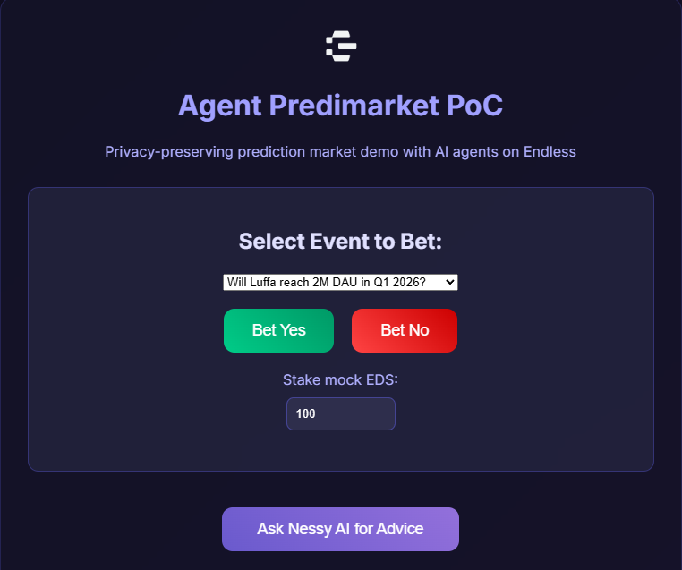

# Agent Predimarket PoC – Endless

A proof-of-concept privacy-preserving prediction market demo powered by mock AI agents on the Endless ecosystem.

**Live Demo:** https://agent-predimarket-poc.vercel.app/



## What It Does
This lightweight web tool demonstrates a simple prediction market where:
- Users select an event from a dropdown (e.g., "Will Luffa reach 2M DAU in Q1 2026?")
- Choose to bet "Yes" or "No" with mock EDS stake
- Click "Ask Nessy AI for Advice" → get a mock AI prediction with probability and reasoning (based on ecosystem trends)
- Simulate bet resolution (win/lose after short delay) with payout or loss

All interactions emphasize privacy: bets protected by DID + E2EE + decentralized relays (no data leakage).

## Why It Matters to the Endless Ecosystem
- **Showcases AI agent potential**: Demonstrates how agents can provide predictive insights while preserving privacy.
- **Privacy-first design**: Aligns with Endless's core mission (borderless, user-owned data) – no centralized server tracks bets.
- **Gamification & engagement**: Ties into Odyssey points/rewards system, encouraging user participation and retention.
- **Onboarding & education**: Helps devs/users understand how prediction markets can work on privacy-focused chains like Endless.
- **Scalable seed**: Can evolve into real on-chain betting with EDS, Nessy utilities, and agent-driven analysis.

## Features (MVP)
- Event selection (dropdown with multiple real-world Endless-related predictions)
- Mock stake input & bet placement (Yes/No)
- Nessy AI mock analysis (probability + reasoned advice)
- Simulated resolution with win/loss feedback
- Responsive dark-mode UI (Endless aesthetic)
- Pure HTML/CSS/JS – no frameworks, easy to extend

## How to Run / Test
1. Clone the repo:
   ```bash
   git clone https://github.com/duchth1993/agent-predimarket-poc.git
